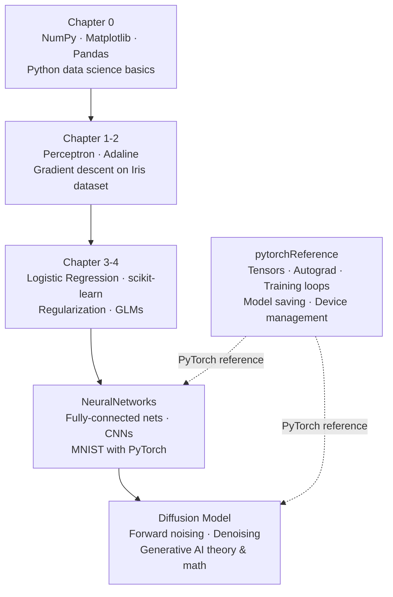

# Machine-Learning

A collection of Jupyter notebooks covering machine learning fundamentals through advanced deep learning topics, using Python, scikit-learn, and PyTorch.

## Structure

```
Machine-Learning/
├── Chapter 0.ipynb          # Python & data science prerequisites
├── Chapter 1-2.ipynb        # ML fundamentals & linear classifiers
├── Chapter 3-4.ipynb        # scikit-learn classifiers & model evaluation
├── NeuralNetworks.ipynb     # Neural networks & CNNs with PyTorch
├── Diffusion Model.ipynb    # Generative AI via diffusion models
├── pytorchReference.ipynb   # PyTorch API reference & patterns
├── data/                    # Datasets used across notebooks
└── Medias/                  # Images and media assets
```

## Notebook Overview



| Notebook | Topic | Key Concepts |
|---|---|---|
| [Chapter 0.ipynb](Chapter%200.ipynb) | Prerequisites | NumPy, Matplotlib, Pandas |
| [Chapter 1-2.ipynb](Chapter%201-2.ipynb) | ML Fundamentals | Perceptron, Adaline, Gradient Descent |
| [Chapter 3-4.ipynb](Chapter%203-4.ipynb) | Classical ML | Logistic Regression, scikit-learn, Regularization |
| [NeuralNetworks.ipynb](NeuralNetworks.ipynb) | Deep Learning | CNNs, PyTorch, MNIST |
| [Diffusion Model.ipynb](Diffusion%20Model.ipynb) | Generative AI | Diffusion process, Denoising networks |
| [pytorchReference.ipynb](pytorchReference.ipynb) | PyTorch Reference | Tensors, Autograd, Training patterns |
