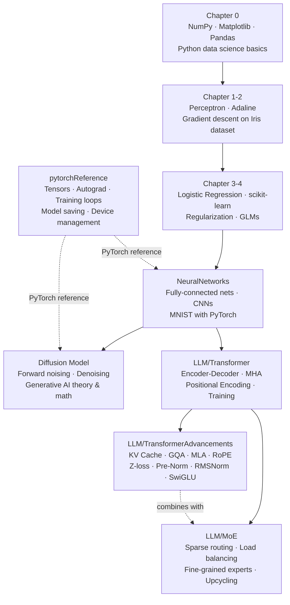

# Machine-Learning

A collection of Jupyter notebooks covering machine learning fundamentals through advanced deep learning topics, using Python, scikit-learn, and PyTorch.

## Structure

```
Machine-Learning/
├── Chapter 0.ipynb              # Python & data science prerequisites
├── Chapter 1-2.ipynb            # ML fundamentals & linear classifiers
├── Chapter 3-4.ipynb            # scikit-learn classifiers & model evaluation
├── NeuralNetworks.ipynb         # Neural networks & CNNs with PyTorch
├── Diffusion Model.ipynb        # Generative AI via diffusion models
├── pytorchReference.ipynb       # PyTorch API reference & patterns
├── LLM/
│   ├── Transformer.ipynb        # Original transformer architecture (encoder-decoder)
│   ├── TransformerAdvancements.ipynb  # Modern LLM optimizations (KV Cache, GQA, MLA, RoPE, MoE)
│   └── MoE.ipynb                # Mixture of Experts architecture
├── data/                        # Datasets used across notebooks
└── Medias/                      # Images and media assets
```

## Notebook Overview



### Core ML & Deep Learning

| Notebook | Topic | Key Concepts |
|---|---|---|
| [Chapter 0.ipynb](Chapter%200.ipynb) | Prerequisites | NumPy, Matplotlib, Pandas |
| [Chapter 1-2.ipynb](Chapter%201-2.ipynb) | ML Fundamentals | Perceptron, Adaline, Gradient Descent |
| [Chapter 3-4.ipynb](Chapter%203-4.ipynb) | Classical ML | Logistic Regression, scikit-learn, Regularization |
| [NeuralNetworks.ipynb](NeuralNetworks.ipynb) | Deep Learning | CNNs, PyTorch, MNIST |
| [Diffusion Model.ipynb](Diffusion%20Model.ipynb) | Generative AI | Diffusion process, Denoising networks |
| [pytorchReference.ipynb](pytorchReference.ipynb) | PyTorch Reference | Tensors, Autograd, Training patterns |

### Large Language Models (LLM/)

| Notebook | Topic | Key Concepts |
|---|---|---|
| [LLM/Transformer.ipynb](LLM/Transformer.ipynb) | Transformer Architecture | Tokenization, Positional Encoding, MHA, Masked Attention, Cross-Attention, Encoder-Decoder |
| [LLM/TransformerAdvancements.ipynb](LLM/TransformerAdvancements.ipynb) | Modern LLM Optimizations | KV Caching, GQA, MLA, RoPE, RoPE+MLA, Z-loss, Pre-Norm, RMSNorm, SwiGLU/ReGLU, Parallel Layers |
| [LLM/MoE.ipynb](LLM/MoE.ipynb) | Mixture of Experts | Sparse Routing, Top-K Expert Selection, Load Balancing Loss, Fine-Grained Experts, Upcycling |

## Topic Deep-Dives

### Transformer Advancements (`LLM/TransformerAdvancements.ipynb`)

| Section | Summary |
|---|---|
| **KV Caching** | Caches Key/Value vectors from past tokens to avoid recomputation during autoregressive generation; analyzes arithmetic intensity trade-offs |
| **Group Query Attention (GQA)** | Reduces KV cache memory by sharing K/V heads across groups of Q heads; generalizes both MHA (n_g=h) and MQA (n_g=1) |
| **Multi-head Latent Attention (MLA)** | Compresses K/V into a low-dimensional latent vector; rearranges computation to absorb projection weights into Q for cache efficiency |
| **RoPE** | Rotary Position Embedding encodes relative positions by rotating Q/K vectors in 2D blocks; position-aware without absolute embeddings |
| **RoPE + MLA** | Resolves incompatibility between RoPE and MLA by splitting Q/K into RoPE and non-RoPE parts, then concatenating before attention |
| **Z-loss** | Regularizes the output softmax normalizer to stay near 1, preventing training instability spikes |
| **Pre-Norm / RMSNorm** | Layer norm placed before (not after) sublayers for stability; RMSNorm drops mean-centering for fewer compute/memory ops |
| **Gated Activations** | SwiGLU/ReGLU use input-dependent gates for selective token processing; FFN hidden dim reduced to ~2/3 to compensate |
| **Parallel Layers** | Attention and FFN run in parallel (rather than sequentially) to improve throughput |
| **QK Norm** | LayerNorm on Q and K before attention to prevent attention score instability |
